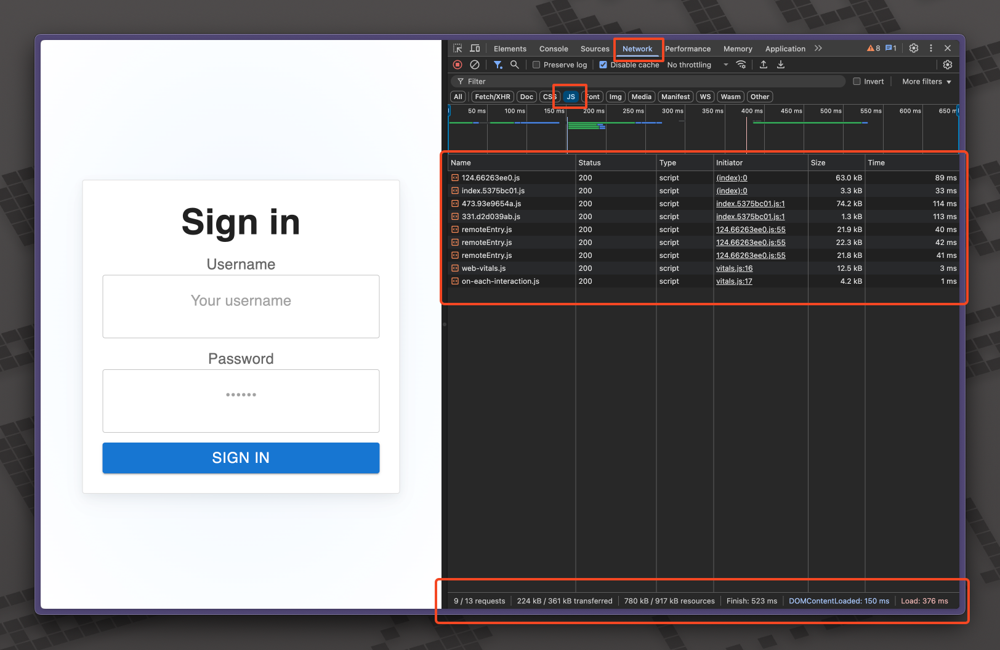
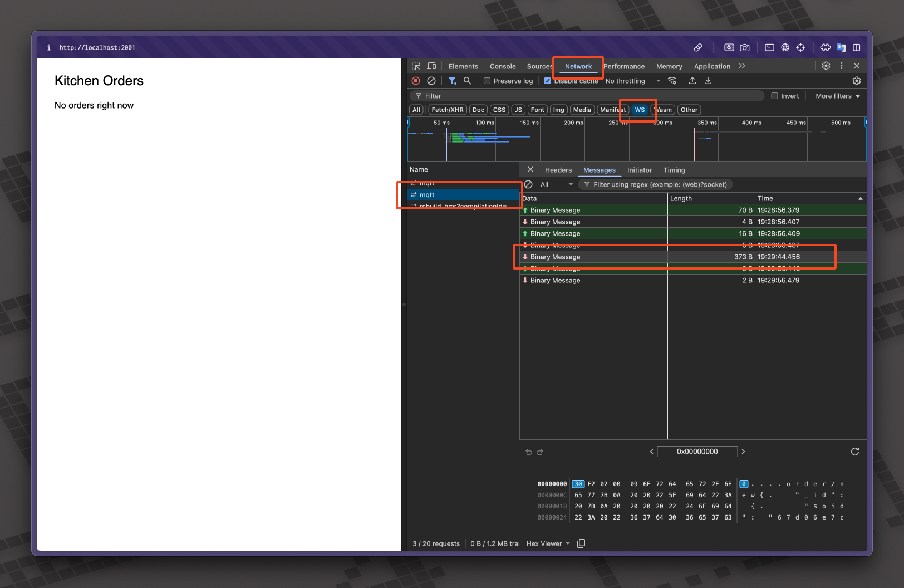
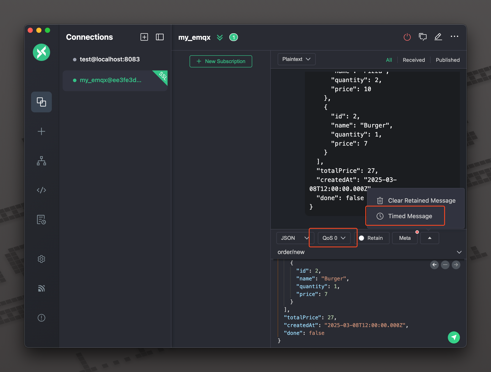
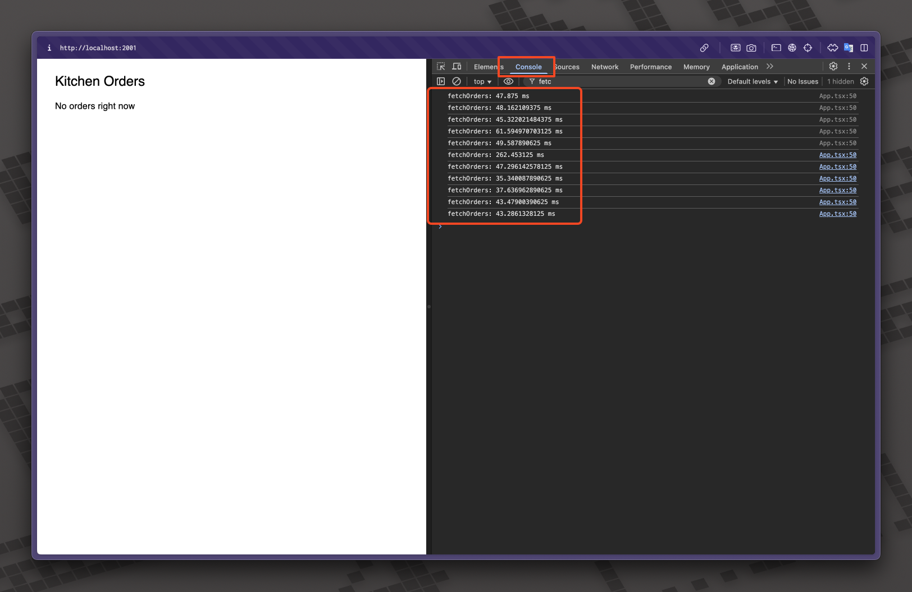

# Príprava experimentov

## Prerekvizity

1. Nasadené aplikácie podľa pokynov v `system_docs.md`
2. Nainštalovaný MQTTX pre sledovanie MQTT správ (https://mqttx.app/)
3. Hocijaký prehliadač s devtools (napr. Chrome, Firefox)

## Meranie dĺžky načítania webovej aplikácie

V devtools otvorte sekciu `Network` a v nej sledujte časy ako dlho trvalo prehliadaču načítanie jednotlivých assetov (JS, CSS). V dolnej časti možno pozorovať celkový čas trvania načítania aplikácie `Load`.

Okrem toho je možné využiť komponent `Profiler`, ktorý poskytuje React a pomocou neho merať rôzne vlastnosti aplikácie. Príklad ako ho možno použiť si môžete pozrieť buď [v kóde](https://github.com/Srenky/pos-composite-ui/blob/main/apps/monolith-app/src/App.tsx) alebo na https://react.dev/reference/react/Profiler



## Meranie latencie - MQTT

V devtools otvorte sekciu `Network`, prepnite sa do časti `WS` a kliknite na položku `mqtt` (je dôležité aby ste mali devtools otvorené už keď sa aplikácia pripája na brokera, v prípade, že ho tam stále nevidíte, refresh stránky väčšinou pomôže).



Pomocou MQTTX sa pripojte na MQTT brokera a môžete simulovať posielanie správ. MQTTX umožňuje jednoducho meniť QoS počas testovania a takisto nastaviť `Timed Message` teda periodické posielanie správy pre jednoduché testovanie.



## Meranie latencie - REST

Pre meranie latencie je možné použiť pomocné výpisy do konzole pomocou `console.time a console.timeEnd` pred a po zavolaní na REST endpoint. Nižšie je ukážka ako je môžné tieto výpisy využiť.

```javascript
const fetchOrders = async () => {
  console.time("fetchOrders");
  const response = await fetch("https://rest-api-url/orders");
  const data = await response.json();
  console.timeEnd("fetchOrders");
  // Do something with the data ...
};
```

Pre zjednodušenie testovania sme pripravili aj [skript](https://github.com/Srenky/pos-composite-ui/blob/main/apps/rest/script.sh), ktorý v periodických intervaloch (1 až 5 sekúnd) vygeneruje náhodnú objednávku a túto objednávku pošle na backend.

Po spustení skriptu a odkomentovaní časti kódu možno v konzole v devtools sledovať ako aplikácia periodicky vypisovať časy ako dlho trvalo volanie na backend až po získanie dát.



## Meranie latencie pri rastúcej veľkosti prenášaných dát

Pri tomto experimente využite rovnaké postupy ako pri predošlích experimentoch s latenciou, pričom meňte veľkosti prenášaných dát v prípade obidvoch protokolov. Aj tu si môžete pomôcť pomocným skriptom, ktorý môže tieto dáta pre vás vygenerovať.
