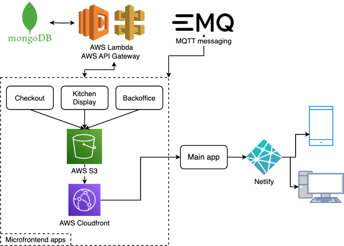

# Systémová príručka

## Architektúra experimentálneho POS systému

Experimentálny POS systém je založený na mikrofrontendovej architektúre s využitím hybridnej aplikácii, ktorá systému sprístupňuje natívne platformové funkcie. Na obrázku nižšie možno vidieť prehľad tejto architektúry.



## Aplikácie tvoriace systém

- **Checkout app** - aplikácia pre obsluhujúci personál na správu objednávok a platieb
- **Kitchen display app** - aplikácia pre kuchynský personál na prehľad aktuálnych objednávok
- **Backoffice app** - aplikácia pre manažéra poskytujúca prehľad tržieb a aktuálneho menu
- **POS Portal app** - aplikácia, ktorá integruje všetky mikrofrontendy do jedného celku
- **MQTT broker** - slúži na okamžitú komunikáciu medzi webovými aplikáciami
- **REST backend** - kombinácia AWS Lambda a AWS API Gateway služieb na vytvorenie jednoduchého RESTful API
- **mongoDB databáza** - databáza obsahujúca kolekcie používateľov a objednávok

## Štruktúra kódu

### Webové aplikácie


Každá webová aplikácia má podobnú štruktúru, nakoľko boli vytvorené rovnakým spôsobom (pre bližšie info možné pozrieť na https://module-federation.io/guide/start/quick-start.html). Súbor `rsbuild.config.ts` je dôležitý pre správne fungovanie každého mikrofrontendu, nakoľko obsahuje konfigurácie spojené s module federation. Priečinok `src` obsahuje všetky assety tvoriace UI aplikácie, pričom hlavná časť UI je v súbore `App.tsx` a ďalšie pomocné komponenty sa nachádzajú v priečinku `components`. Súbory `.env.development` a `.env.production` nám poslúžia pri lokálnom testovaní a pri generovaní finálnej aplikácie pre produkciu. Nakoniec súbor `package.json` obsahuje okrem základných informácií o aplikácii aj zoznam všetkých jej dependencií.

### REST API


REST API sa má značne jednoduchšiu štruktúru, nakoľko každý endpoint predstavu osobitnú AWS Lambda funkciu, ktoré sú integrované do jedného AWS API Gateway, ktoré vieme volať z našich aplikácií. Všetko potrebné ako sú napojenie na databázu a volania do nej sú obsiahnuté v súbore `index.mjs`.

Naše API tvoria tieto endpointy:

- **GET** `/menu` - vráti aktuálne menu
- **GET** `/orders` - vráti aktuálne objednáky, ktoré ešte nie sú hotové
- **POST** `/orders` - pridá novú objednávku
- **PUT** `/orders/{id}` - zmení stav objednávky s daným id na 'done'
- **GET** `/analytics` - vráti analytické dáta, ako počet hovotých objednávok a tržby z nich

Dátový model pre objednávku (príklad)

```json
{
  "_id":"67d06e7c7385d91b4265b5d8",
  "tableNumber":5,
  "orderItems":[
    {
      "id":1,
      "name":"Pizza",
      "quantity":2,
      "price":10
    },
    {
      "id":2,
      "name":"Burger",
      "quantity":1,
      "price":7
    }
  ],
  "totalPrice":27,
  "createdAt":"2025-03-08T12:00:00.000Z",
  "done":false
}
```

### Hybridná aplikácia


Hybridná aplikácia bola navrhnutá pre platformu Android, preto je dôležitý súbor `AndroidManifest.xml`, ktorý je potrebný napríklad pre pridanie povolení pre funkcie ako je NFC. Ďalej súbory končiace `.xaml` (napr. `MainPage.xaml`) obsahujú UI pre danú 'stránku' aplikácie. Súbory končiace `.xaml.cs` (napr. `MainPage.xaml.cs`) zase obsahujú logiku relevatnú pre tú stránku.

### MQTT broker (messaging)

Náš systém využíva MQTT broker od spoločnosti EMQX (https://www.emqx.com/en). Tento broker je využitý na komunikáciu medzi mikrofrontendami a v rámci messagingu sa posielajú tieto správy:

- `menu/new` - pridanie novej položky do menu
- `menu/remove` - odstránenie položky z menu
- `menu/update` - upravenie existujúcej položky v menu
- `order/new` - pridanie novej objednávky
- `order/ready` - upravenie stavu objednávky na 'done'

## Lokálne spustenie

Táto časť je orientovaná na lokálne spustenie projektu za účelom vývoja alebo testovania.

### Podmienky pre systém

#### Webové aplikácie

- nainštalovaný `bun` (https://bun.sh/)
- hocijaký textový editor/IDE

Pre spustenie aplikácie je potrebné urobiť nasledujúce kroky:

1. v súbore `.env.development` upraviť hodnotu **MQTT_BROKER_URL**, aby odkazovala na nášho lokálne bežiaceho brokera
2. rovnako treba upraviť hodnotu **REST_API_URL**, aby odkazovala na lokálne bežiaci backend
3. skontrolovať v súbore `rsbuild.config.ts` hodnotu `port`, aby bol daný port voľný a prípadne ho zmeniť
4. v termináli spustiť príkaz `bun install`, ktorý nainštaluje všetky potrebné dependencie zadefinované v súbore `package.json`
5. nakoniec sa aplikácia spustí príkazom `bun run dev`

#### REST API

- nainštalovaný `node` (https://nodejs.org/en)
- hocijaký textový editor/IDE

Pre spustenie aplikácie je potrebné urobiť nasledujúce kroky:

1. upraviť v súbore `.env` hodnotu `MONGODB_URL`, aby odkazovala na relevantný mongoDB cluster
2. v termináli spustiť príkaz `npm install`, ktorý nainštaluje všetky potrebné dependencie zadefinované v súbore `package.json`
3. v termináli spustiť príkaz `npm run server`, ktorým sa spustí lokálny server

#### Hybridná aplikácia

- nainštalovaný .NET SDK v8 (https://dotnet.microsoft.com/en-us/download)
- IDE vhodné pre prácu s jazykom C# a .NET (napr. JetBrains Rider)

Pre spustenie aplikácie je potrebné urobiť nasledujúce kroky:

1. mať nainštalovaný NuGet `Plugin.NFC`
2. Android zariadenie pripravené na testovanie aplikácie pomocou Android Debug Bridge (https://developer.android.com/tools/adb)
3. spustiť aplikáciu, IDE sa postará o nainštalovanie potrebných dependencií, kompilácie a aplikáciu automaticky spustí


## Nasadenie aplikácií

Táto časť je orientovaná na nasadenie webových aplikácií a REST API na služby AWS (https://aws.amazon.com/) a Netlify (https://www.netlify.com/).

Pre začatím je potrebné mať vytvorený účet na službách Netlify a AWS .

### Webové aplikácie

Pred samotným nasadením potrebujeme vygenerovať bundle aplikácie pripravený na produkciu. To docielime pomocou príkazu `bun run build`. Tento príkaz nám vygeneruje priečinok `dist`, ktorý obsahuje všetok potrebný kód pre nasadenie webovej aplikácie.

Pre nasadenie aplikácie POS Portal sa využíva cloudová služba Netlify.

Je potrebné vytvoriť nový projekt, pod ktorým vieme pridať novú webovú aplikáciu jednoduchým nahratím `dist` priečinka a Netlify automaticky nasadí aplikáciu na náhodne vygenerovanej doméne.


V prípade nových iterácií je možné aplikáciu aktualizovať opäť nahratím priečinka v časti `Deploys`.


Mikrofrontendové aplikácie boli uložené na cloudovom úložisku AWS S3 a sprístupnené pomocou AWS CloudFront.

Pre každú aplikáciu je potrebné vytvoriť S3 bucket s vhodným menom. V sekcii AWS S3 je potrebné kliknúť na tlačidlo `Create bucket` a vyplniť meno pre S3 bucket.


Do vytvoreného bucketu sa potom nahrá priečinok `dist` pomocou tlačidla `Upload`.


Ako ďalší krok je potrebné vytvoriť pre bucket CloudFront distribúciu. V sekcii AWS CloudFront vieme vytvoriť novú distribúciu pomocou tlačidla `Create distribution`.


Ďalej treba pre distribúciu vybrať jej origin, čo je v našom prípade novovytvorený S3 bucket.


### REST API

Na nasadenie backendu sa použila kombinácia AWS Lambda a AWS API Gateway. Každý z už spomínaných endpointov má svoju vlastnú Lambda funckiu a tieto funckie sú spojené v jednom API Gateway.

Pre vytvorenie Lambda funckie v sekcii AWS Lambda slúži tlačidlo `Create funcion`.


V tejto časti je potrebné zadať iba meno funkcie, ostatné predvyplnené veci môžu ostať.


Do vytvorenej Lambda funckie je teraz potrebné nahrať náš kód. Pred nahratím treba zazipovať všetok kód do ZIP súboru a tento súbor potom vieme nahrať pomocou tlačidla `Upload from` a zvoliť možnosť `.zip file`.


Takúto Lambda funkciu teraz vieme integrovať do API Gateway. V sekcii AWS API Gateway kliknite na tlačidlo `Create API`.


Vyberte možnosť HTTP API.


Pomenujte nové API a potom sa môžete presunúť na koniec procesu, keďže ostatné kroku nie sú potrebné.


V novovytvorenom API pridajte novú `Route` kliknutím na tlačidlo `Create` v sekcii `Routes`. Vyberte typ (`GET`, `POST`, ...) a cestu (napr. `/api/new-endpoint`).


Potom v sekcii `Integrations` pre túto `Route` viete pridať integráciu s Lambda funkciou pomocou dropdownu, kde budú zobrazené dostupné Lambda funkcie.


